# face-anchor

Face identification → web/social discovery → on-chain verification.

A three-stage pipeline: detect+embed a face (Stage 1), search live public
web/social corpora for a genuinely matching post (Stage 2), and anchor a
canonical fingerprint of the discovery on a blockchain so the finding can be
independently re-verified later (Stage 3). Full design rationale, latency
budget, and threat model live in [`PRD_face_anchor.md`](PRD_face_anchor.md) —
this README covers what's actually built and how to run it.


## Architecture (as built)

Diagrams describe what is actually in this repo, with numbers measured on
the build machine (i7-13700HX / RTX 4050). PRD §4 has the original design;
this is the shipped version.

### The whole idea

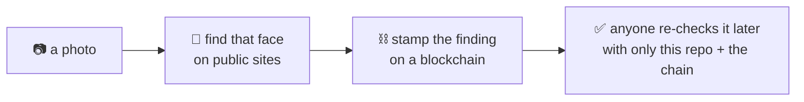

The stamp is what makes a finding checkable by someone who has no reason
to trust us. Everything else here exists to make that stamp mean
something honest.

### Step 1 — what happens to your photo

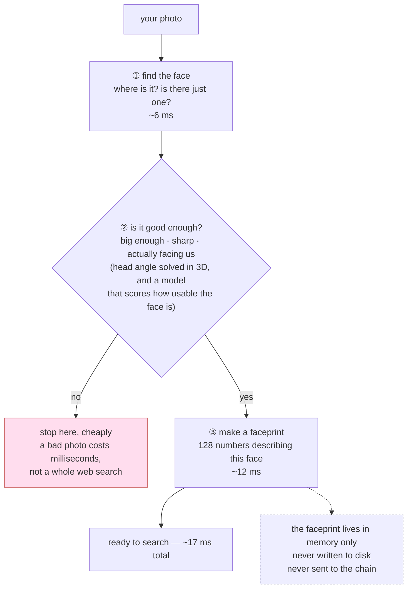

The order matters: the cheap quality check runs **before** the expensive
part, so a useless photo is rejected in milliseconds.

When the photo comes from the webcam there is one more check, and it is the
one that decides what the evidence *means*: an anti-spoofing model asks
whether it is looking at a person or at a photograph of one. Without it, a
printed face held to the lens produces a perfectly valid, perfectly
tamper-evident bundle attesting to something that never happened. The capture
also keeps the **best** of a dozen frames rather than the first one that
passes, because your reaction time should not decide the quality of a probe
you keep forever.

### Step 2 — finding it online

Three different questions, three different arms. Exactly one runs per
invocation, and the evidence file records which — they are not the same
claim, and a reader must be able to tell them apart.

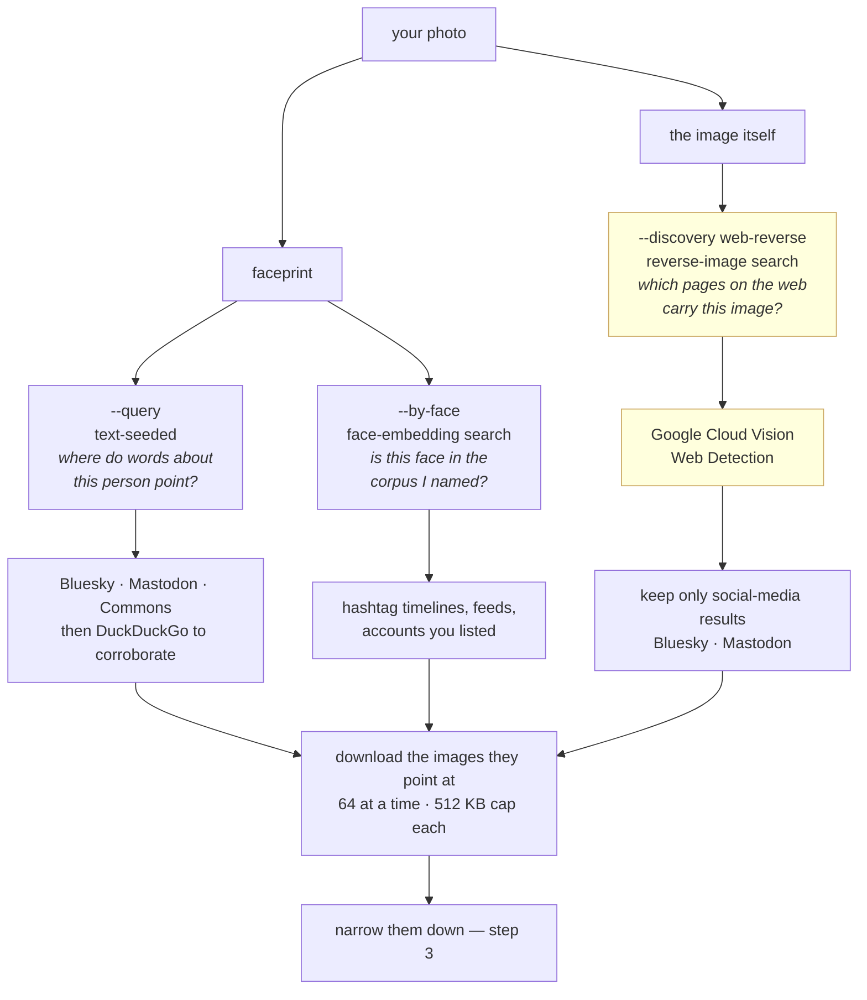

Only the third arm sends the photograph off this machine (shaded above), and
the CLI says so and asks before it does. The other two send hashes and words.

**A reverse-image hit is never a match on its own.** The provider says "this
image appears on that page"; it does not say "that page shows this person".
Every candidate it returns goes through the same face verification as every
other arm, in step 3, and anything that fails is discarded.

### Step 3 — narrowing 120 images down to one

Cheapest test first, so the expensive one runs on as few images as possible.

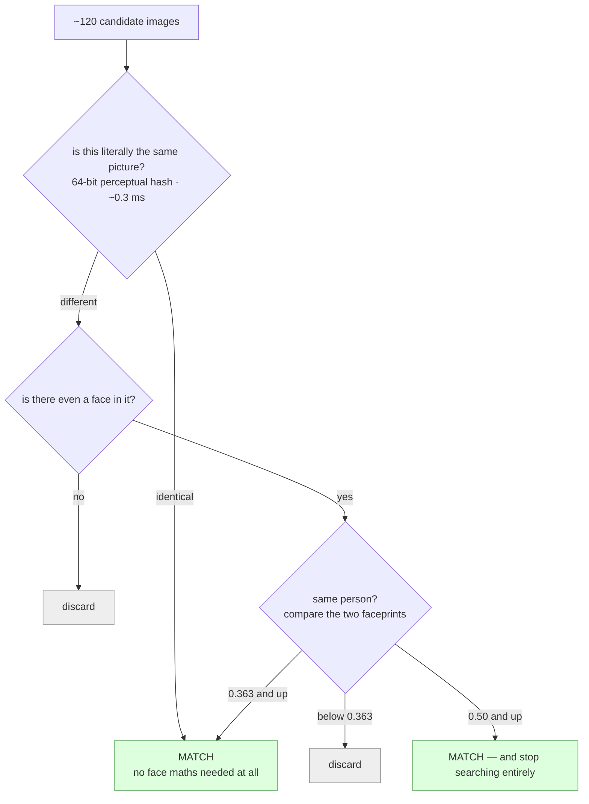

### Step 4 — making the finding permanent

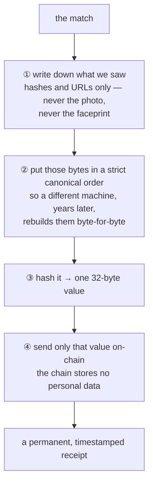

### Step 5 — anyone re-checking it later

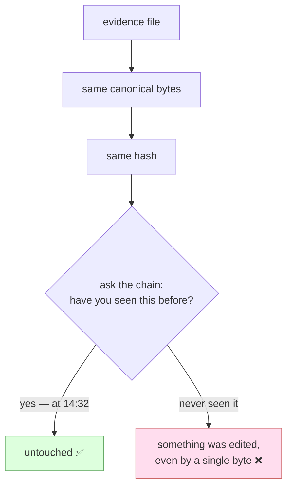

That second branch **is** the tamper demo: change one character in the
evidence file and its hash no longer matches anything on the chain.

---

## Reference — the precise view

### Module map

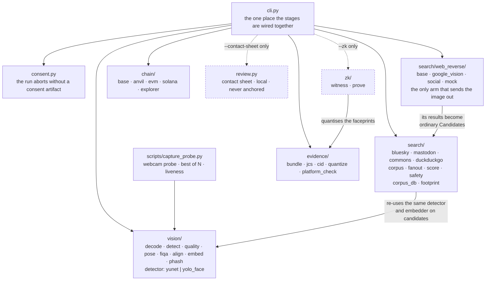

Files worth knowing about:

| File | Why it exists |
|---|---|
| `vision/embed.py` | Two paths: CPU for the single probe, CUDA batch-32 for candidates. Preprocessing is pinned to match OpenCV's own C++ output exactly (RGB, raw 0–255) |
| `vision/models.py` | Derives a batch-dynamic ONNX export — the upstream weights hardcode batch=1, which would make the GPU path pointless |
| `vision/_cuda_libs.py` | dlopens cuDNN/cuBLAS from site-packages so no `LD_LIBRARY_PATH` export is needed |
| `vision/pose.py` | Real yaw/pitch/roll, solved from the 5 landmarks the detector already returns. Replaces a symmetry ratio that could not see pitch or roll at all |
| `vision/yolo_face.py` | Alternative detector (`FACEANCHOR_DETECTOR=yolo`): YOLOv8-face, same 5-keypoint row layout as YuNet so alignment and pose are untouched. **GPL/AGPL weights** — see Licences |
| `vision/fiqa.py` | Learned face quality (eDifFIQA-T, MIT). Laplacian variance measures detail in the *photograph*; this scores usability of the *face* |
| `vision/liveness.py` | Anti-spoofing at capture (MiniFASNet ensemble, Apache-2.0) — a printed photo otherwise anchors a valid bundle |
| `search/fanout.py` | HTTP/2 pool, per-source timeouts, 512 KB range-capped fetches |
| `search/web_reverse/google_vision.py` | The real reverse-image call: `images:annotate` with `WEB_DETECTION`. No credentials, no run — there is no offline fallback on purpose |
| `search/web_reverse/social.py` | Decides which of the provider's open-web results are social-media posts, by a configurable domain map plus Mastodon's own URL layout |
| `search/web_reverse/base.py` | The error hierarchy that keeps "the search broke" from ever reading as "the face is nowhere" |
| `search/safety.py` | Drops explicit posts before they are fetched, using each platform's own flags/labels; refuses adult corpus specs outright |
| `search/corpus_db.py` | Content-addressed local corpus: image bytes, pHash, provenance, face geometry — and no embeddings, enforced by test |
| `search/footprint.py` | Scores a probe against every image in a fixed corpus and reports the distribution, not just the winner |
| `evidence/jcs.py` | RFC 8785 canonicalisation — hashing `json.dumps` output would not be reproducible |
| `evidence/platform_check.py` | Detects the platform editing or deleting a post after we recorded it |
| `chain/explorer.py` | Hands a stranger a link to the chain by a route this code does not control. No Anvil entry, on purpose — a local devnet has no public footprint to point at |
| `review.py` | `--contact-sheet`: probe and every fetched candidate, inlined and score-ordered, so a 0.46 can be judged by eye. Writes third-party faces to disk; opt-in, local, never anchored |

### Choosing a detector

```bash
FACEANCHOR_DETECTOR=yolo faceanchor run ...     # YOLOv8-face
FACEANCHOR_DETECTOR=yunet faceanchor run ...    # OpenCV YuNet
```

Both return the same 5 landmarks in the same order, so alignment, pose, the
quality gate and liveness are indifferent to the choice. Two things are not:

- **The probe and the candidates must use the same one.** They do
  automatically — `score.py` re-detects every candidate through the same
  `detect_faces()` the probe went through. It matters because the two align
  slightly differently: the same face embeds to a cosine of **0.93–0.98**
  across backends, not 1.0. That is far above the 0.363 accept threshold, so a
  person still matches themselves, but a marginal candidate can move by a few
  hundredths. The bundle records `probe.detector` so two bundles are never
  silently compared across backends.
- **Box scale.** YOLO's boxes run tighter (0.79–1.03× of YuNet's on the images
  in this repo), so `MIN_BBOX_PX` is scaled by the backend's factor to keep the
  gate a statement about the face rather than about the rectangle. That factor
  is provisional — n=3 images of one subject — and wants re-deriving over a
  corpus.

### Licences

Everything in the model cache is Apache-2.0 or MIT — YuNet and SFace (OpenCV
Zoo), MiniFASNet (Silent-Face-Anti-Spoofing), eDifFIQA — which is why those
were chosen over better-known alternatives like CR-FIQA (CC BY-NC) or the
InsightFace zoo (non-commercial). Two exceptions, both deliberate:

| Component | Licence | Scope |
|---|---|---|
| `contracts/src/Groth16Verifier.sol` | GPL-3.0 | Generated by snarkjs; reached only by the opt-in `--zk`/`anchorWithProof` path |
| `yolov8n-face.onnx` | GPL/AGPL (YOLOv8-derived) | Opt-in via `FACEANCHOR_DETECTOR=yolo` |

The YOLO one is the more consequential: a detector sits on the default path
and cannot be scoped away the way the verifier is, so selecting it is a
licensing decision about the whole project rather than about one feature. It
is left opt-in for that reason, and the permissively-licensed YuNet remains
the default.

### Chain adapters

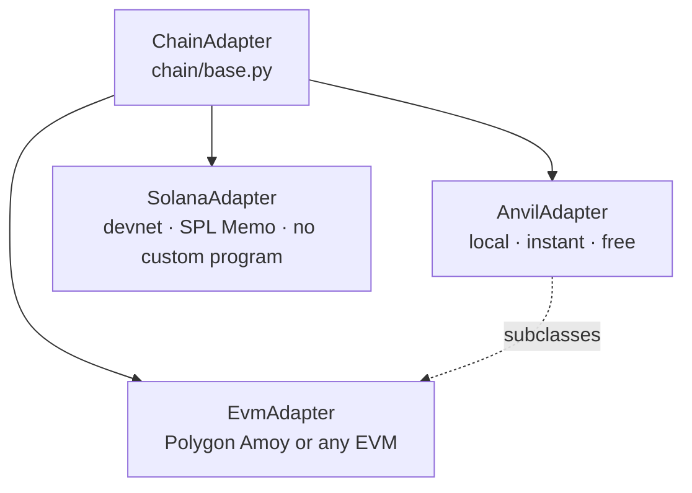

| Operation | anvil | amoy | solana |
|---|:---:|:---:|:---:|
| `anchor` | ✓ | ✓ | ✓ |
| `verify` | ✓ | ✓ | ✓ * |
| `wait_for_inclusion` | ✓ | ✓ | ✓ |
| `revoke` / `consentStatus` | ✓ | ✓ | ✗ |
| `anchorWithProof` | ✓ | ✓ | ✗ |

\* Wallet-scoped scan of recent signatures, not an O(1) state lookup — SPL
Memo stores no on-chain state by design. The EVM path deliberately keeps
an `anchoredAt` mapping so `verify()` is a single `eth_call` with no
indexer dependency (PRD §6.2).

### The ZK match proof (`--zk`)

Anchoring a score alone is just an assertion — nothing stops an operator
writing down a number they never computed. This makes the score
non-repudiable *without* publishing either faceprint.

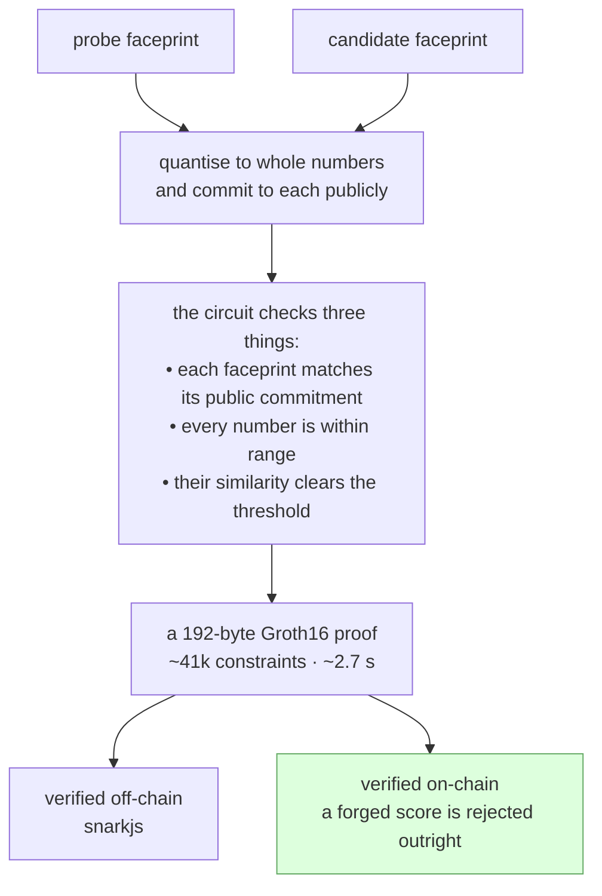

| The proof **does** establish | The proof does **not** establish |
|---|---|
| The prover knows two committed, in-range faceprints | That those faceprints are what the face model actually produced from these two images |
| Their similarity genuinely clears the threshold | That the match is *correct*, or the post authentic |
| The score is non-repudiable, and neither faceprint is ever published | Proving the derivation needs zkML over the whole network (~10⁸ constraints) — out of scope, and the step stays trusted |

`run --zk` anchors through `EvidenceAnchor.anchorWithProof`, not `anchor` —
the chain runs the Groth16 verifier before it will record the digest, so a
proven bundle is one the chain itself checked. `forge-score` is the same path
with a tampered score, which is why it reverts. EVM only: `--chain solana`
refuses `--zk` up front rather than anchoring an unverified score.

### What `verify` can tell you

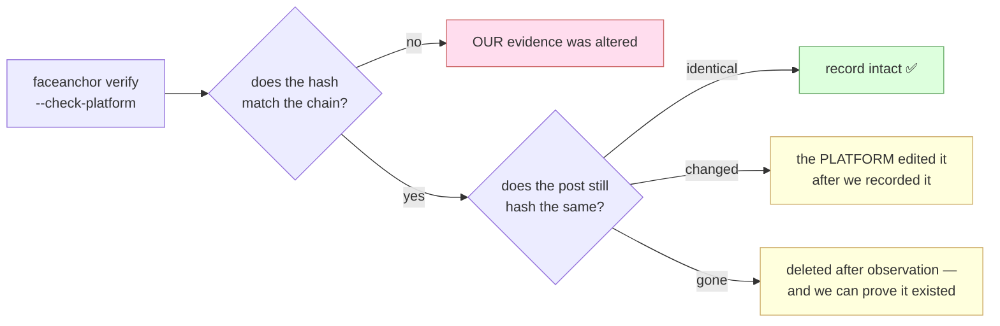

Every `verify` also checks whether the subject has withdrawn consent, and
prints a loud `⚠ CONSENT REVOKED` if so. The post-side check only applies
to Bluesky matches (AT Protocol records carry their own content hash);
Mastodon and Commons report `not_applicable` rather than a false signal.

### Build log

`✓` = exercised live against a real network or chain during the build.
`~` = built and unit-tested, but blocked from live verification by an
external resource (see the status table below).

| # | Shipped | Verified |
|---|---|---|
| M0 | Scaffold — uv venv (3.12), Foundry, model fetch | ✓ |
| M1 | Vision — YuNet + SFace + quality gate | ✓ p50 17 ms |
| M2 | Discovery — Arm A adapters, fanout, scoring cascade | ✓ live self-match |
| M3 | `EvidenceAnchor.sol` + Anvil adapter | ✓ `forge test` |
| M4 | Evidence bundle, JCS/CID, CLI `run`/`verify` | ✓ live tamper demo |
| — | Amoy public testnet path | ~ needs a funded key |
| M5 | Arm B (DuckDuckGo) + consent gate | ✓ 40 merged candidates |
| M6 | Solana SPL Memo adapter | ~ devnet faucet rate-limited |
| M7 | README, architecture, threat model, consent docs | ✓ |
| M8 | Platform-mutation detection + `revoke()` | ✓ live, all four verdicts |
| M9 | ZK L1 — Circom circuit, trusted setup, prove/verify | ✓ live, both polarities |
| M10 | ZK L2 — `Groth16Verifier.sol` + `anchorWithProof` | ✓ live `BadProof` revert |
| M11 | Genuine reverse-image search — provider abstraction, Google Cloud Vision Web Detection, social filtering, `--discovery web-reverse` | ~ needs a Cloud Vision credential; full path verified end-to-end offline against a replayed provider response |
| M12 | Explicit-content filtering at the discovery layer — platform flags/labels, adult-corpus refusal | ✓ live, measured against `#selfie`, `#portrait` and `whats-hot` |
| M13 | Local corpus database + footprint scan — offline, repeatable pipeline runs (`corpus-build`, `--corpus-db`, `corpus-footprint`) | ✓ live, 192-image corpus built and anchored offline end-to-end |

198 tests: 18 Solidity, 180 Python (plus one opt-in live-provider test that
skips without credentials). See [`docs/ARCHITECTURE.md`](docs/ARCHITECTURE.md)
for the prose walkthrough and [`docs/THREAT_MODEL.md`](docs/THREAT_MODEL.md) for
what is and isn't trustless.

## Subject policy (read before running)

This pipeline is a deanonymization primitive. It will not run without an
explicit consent artifact:

```
faceanchor run --probe photo.jpg --query "..." --chain anvil --contract-address 0x...
# ERROR: --subject-consent is required
```

See `consent/self.example.json` and `consent/teammate.example.json`, and
[`docs/CONSENT.md`](docs/CONSENT.md). Default demo subjects are the
builder's own face (Lane A) or a teammate's, with signed consent (Lane B).
See PRD §3 for the full policy and legal basis (India DPDP Act 2023, EU AI
Act Art. 5(1)(e)).

## Setup

Requires: Python 3.12 (not 3.13+ — some pinned wheels lag), [`uv`](https://docs.astral.sh/uv/),
[Foundry](https://getfoundry.sh), and an NVIDIA GPU + CUDA driver if you want
the CUDA execution provider (CPU-only works fine — see PRD §5.4, GPU only
matters for batch-embedding a wide candidate fanout). A V4L2 webcam
(`/dev/video*`) if you want the demo to capture its own probe; otherwise pass
`--probe PHOTO`.

```bash
make setup      # venv (uv), Python deps, ONNX model weights, forge build
make anvil &    # local chain, in another terminal
```

`make setup` installs `onnxruntime-gpu`, but the pip wheel needs cuDNN/cuBLAS
that aren't pulled in automatically by the CUDA driver alone — `pyproject.toml`
pins `nvidia-cudnn-cu12`/`nvidia-cublas-cu12`/`nvidia-cuda-nvrtc-cu12`
explicitly, and `faceanchor.vision._cuda_libs` preloads them at runtime so you
don't need to `export LD_LIBRARY_PATH` yourself. If you have no GPU, ONNX
Runtime falls back to CPU automatically — nothing to configure.

### Optional: public chains

`--chain anvil` needs nothing but `make anvil`. The two public targets read
their keys from the environment, never from a file in the repo:

```bash
# Polygon Amoy — permanent public record
export AMOY_RPC_URL=https://rpc-amoy.polygon.technology
export AMOY_PRIVATE_KEY=0x...              # a funded testnet wallet

# Solana devnet — public, but the cluster is periodically reset
export SOLANA_KEYPAIR=~/.config/solana/id.json   # solana-keygen new -o ...
export SOLANA_RPC_URL=https://api.devnet.solana.com   # optional, this is the default
```

`--chain solana` takes no `--contract-address` (SPL Memo needs no program),
and cannot do `revoke` or `--zk` — both need on-chain state or a verifier
program, which memo-only anchoring does not have. Both commands say so
plainly rather than failing obscurely.

### Optional: ZK match proof (`--zk`)

```bash
cd zk && ./setup.sh   # installs snarkjs+circomlib, compiles the circuit,
                       # fetches a 2^16 Powers-of-Tau ceremony, runs Groth16 setup
```

Needs Node.js (any recent LTS — `nvm install --lts` if you don't have it) and
`circom` (prebuilt binary: https://github.com/iden3/circom/releases). The
base pipeline works without any of this; `--zk` is opt-in.

## Demo

One command runs every act below in order, asserts the expected outcome of
each (including the two that are supposed to *fail*), starts and stops its
own Anvil if none is running, and prints a pass/fail summary:

```bash
./scripts/demo.sh --query "some search terms"
# or: make demo QUERY="some search terms"

# genuine reverse-image search end-to-end (needs a Cloud Vision credential):
export GOOGLE_VISION_API_KEY=...
./scripts/demo.sh --probe photo.jpg --web-reverse --provider google

# the same acts, offline, replaying a saved provider response:
export FACEANCHOR_MOCK_REVERSE_RESPONSE=tests/fixtures/google_web_detection.json
./scripts/demo.sh --probe photo.jpg --web-reverse --provider mock

# offline: build a corpus once, then run the whole demo against it with no
# network at all — the right mode under a restricted network, and the only
# mode that gives the same input every rehearsal:
faceanchor corpus-build --db evidence/corpus-db --corpus mastodon:tag/selfie --pages 3
./scripts/demo.sh --probe photo.jpg --corpus-db evidence/corpus-db

# no camera, repeatable probe, live search: take the probe out of a corpus you
# built from your own photos, then search the live decentralized networks for it
faceanchor corpus-build --db my-corpus --from-dir ~/photos-of-me
./scripts/demo.sh --probe-from-corpus my-corpus --live

# --probe PHOTO       use an existing image instead of the webcam
# --probe-from-corpus DIR   take the probe out of a corpus database instead.
#                     Only images you imported yourself (corpus-build
#                     --from-dir, provenance "local") are eligible — a corpus
#                     of scraped timelines is strangers who posted a photo, not
#                     subjects who agreed to be searched for, and the script
#                     refuses to make one of them the probe (docs/CONSENT.md)
# --probe-pick SEL    which corpus image: sha256 prefix, or 0-based index
# --live              search live public timelines instead of replaying a
#                     corpus database (the default; overrides an earlier
#                     --corpus-db)
# --corpus-db DIR     replay a locally built corpus — offline, repeatable
# --web-reverse       reverse-image discovery instead of corpus/text discovery
# --provider NAME     google | mock
# --camera N          webcam device index [0]
# --headless-capture  no preview window: auto-take the first gate-passing frame
# --no-pause          don't wait for Enter between acts (recording / CI)
# --no-zk             skip the Groth16 acts if zk/setup.sh hasn't been run
# --contract ADDR     reuse an already-deployed EvidenceAnchor
```

### Three discovery modes

They answer three different questions, and the words matter — conflating them
is how a tool ends up claiming more than it did.

| Flag | Name | The question it answers | Does the photo leave your machine? |
|---|---|---|---|
| `--query "..."` | text-seeded | *Where do words about this person point?* | no |
| `--by-face --corpus ...` | face-embedding search | *Is this face anywhere in the corpus I named?* | no |
| `--discovery web-reverse` | **genuine reverse-image search** | *Which pages on the web carry this image?* | **yes** |

Exactly one runs per invocation, and `run.discovery.mode` in the evidence
file records which, so the two claims can never be mistaken for each other
after the fact.

**`--by-face` is not reverse-image search**, and this README used to say it
was. It never submits the image anywhere — it downloads a corpus you named,
embeds every face in it, and queries with the probe's embedding. That is a
face-embedding search over a bounded corpus. Useful, defensible, and a
different thing.

```bash
faceanchor run --probe photo.jpg --subject-consent consent/self.example.json \
  --by-face \
  --corpus mastodon:tag/selfie \
  --corpus mastodon:tag/portrait@mstdn.social \
  --corpus bsky:feed/whats-hot \
  --chain anvil --contract-address $CONTRACT

# Stage 2: face-embedding search over a named corpus — 396 images ingested from 3 corpora
# Stage 2: per-corpus — mastodon:tag/selfie 127, mastodon:tag/portrait@mstdn.social 148, bsky:feed/whats-hot 121
# Stage 2: 392 images fetched, verifying by face (SFace)
```

Corpus specs: `mastodon:tag/<tag>[@instance]`, `mastodon:account/<handle>`,
`bsky:feed/<alias|at-uri>`, `bsky:author/<handle>`. Measured on this machine:
~400 images ingested in 3.5s, fetched in 7s, scored by face in ~7s — 40s
end-to-end including the anchor.

Three properties make this defensible rather than a face-search engine:

- **The corpus is named, not crawled.** You pass the hashtags, feeds and
  accounts to search. There is no untargeted sweep of the open web, which is
  the pattern EU AI Act Art. 5(1)(e) prohibits (PRD §3 cites it).
- **Nothing persists.** The embeddings live in process memory for one run and
  die with it — PRD §3's "no persistent embedding store" is what separates
  this from a facial recognition database, so it is load-bearing, not an
  optimisation.
- **The bundle says which mode found the match.** `run.discovery` records
  `by_face` plus the corpus specs and image count, or `text_seeded` plus the
  *hash* of the query (the query describes a person, so it never goes on
  chain in the clear). A verifier can tell the two claims apart.

Recall is bounded by what you ingest — a few hundred to a few thousand images,
not the web. It will not find a stranger, and that is a deliberate ceiling.

### A local corpus database (`corpus-build`) — the test bench

Every run against live timelines is a different experiment. The tags move,
the feed reorders, a source 403s, and a candidate that scored 0.46 yesterday
is gone today. That is fine for a demo and useless for testing, where the
question is *did my change alter the outcome* and the answer must not depend
on what strangers posted this morning.

So compile the corpus once and replay it:

```bash
# build it (fetches live, applies the explicit-content filter, keeps the bytes)
faceanchor corpus-build --db evidence/corpus-db \
  --corpus mastodon:tag/selfie \
  --corpus mastodon:tag/portrait@mstdn.social \
  --corpus bsky:feed/whats-hot --pages 3

# add images you already hold and are entitled to use
faceanchor corpus-build --db evidence/corpus-db --from-dir path/to/photos --append

# run the whole pipeline over it — offline, deterministic
faceanchor run --probe photo.jpg --subject-consent consent/self.example.json \
  --by-face --corpus-db evidence/corpus-db \
  --chain anvil --contract-address $CONTRACT
```

A real build, measured:

```
Ingested 343 candidate URLs — mastodon:tag/selfie 83, mastodon:tag/portrait@mstdn.social 141, bsky:feed/whats-hot 119
Explicit-content filter removed 46 — 46 flagged sensitive (mastodon)
Fetched 338 images

Corpus database written: evidence/corpus-db
  added 191, already present 0, duplicate bytes 0, undecodable 0, no face 147
  191 images (0 -> 191), 243 faces, 28 multi-face, 11.7 MB
  manifest sha256: f096a865167d2e555e57803baf1c6c7e02c5cf222396e88fda3ebfd18faca0ee
```

Four things fall out of having a fixed corpus:

- **The network stops mattering.** `--corpus-db` never opens a socket, so CI,
  a restricted network, and a demo on a bad connection all behave identically.
- **Nothing explicit is re-downloaded.** The safety filter runs at *build*
  time, so an explicit post is excluded once instead of on every rehearsal.
- **Faceless images are dropped at build time too** — 147 of 338 above. They
  can never match a face, so storing them would cost disk and scoring time
  for nothing.
- **A footprint becomes measurable** (below), because the denominator holds
  still.

#### What it stores, and what it deliberately does not

`manifest.jsonl` (one header line, then one line per image) plus
content-addressed `images/<xx>/<sha256>`. Per image: pHash, byte length,
dimensions, platform, post URI, image URL, author, and face **geometry** —
how many faces, their boxes, detector confidence.

**No face embeddings.** PRD §3's "no persistent embedding store" is what
separates this repo from the untargeted facial-recognition database EU AI Act
Art. 5(1)(e) prohibits, and a directory of 128-d templates on disk is exactly
that database. A bounding box says *a face is here*; an embedding says *this
is who it is*, and only the first is safe to leave lying around. Embeddings
are recomputed in memory at query time — a batch SFace pass over a few
hundred crops, seconds of work for a property worth far more than seconds.

The manifest header says so in the artifact itself, so a reader never has to
take this README's word for it:

```json
{"kind": "faceanchor.corpus_db", "images": 192, "faces_total": 244,
 "contains_embeddings": false,
 "note": "face geometry only; no embeddings are stored (PRD §3: no persistent embedding store)"}
```

There is a test that enforces it structurally rather than by string-matching:
it walks every JSON value in the manifest and fails on any numeric run longer
than a bounding box, so renaming a key would not let a template slip through.

Deduplication is by **content**, not URL — the same photo reposted under two
URLs is one entry, which a URL-keyed store would double-count and then score
twice. Reads verify the hash rather than trusting the filename; content
addressing that is never checked has all the cost and none of the benefit.

It is still a directory of strangers' faces on your disk. It lands under
`evidence/` (gitignored), is never anchored, and is yours to delete.

#### The bundle records that it was a replay

```json
"discovery": {
  "mode": "by_face",
  "source": "corpus_db",
  "corpus": ["bsky:feed/whats-hot", "mastodon:tag/portrait@mstdn.social", "mastodon:tag/selfie"],
  "corpus_images": 192,
  "corpus_db_manifest_sha256": "32db61658a6b132c2fdee44ecc8392ea89e7112c37b4d3088f2a2ac3e167d1cf"
}
```

Provenance is preserved — `match.uri` still names the real post, because the
bytes are the same bytes — but the run is not passed off as live. The
manifest hash pins the **exact** corpus that was searched, so "192 images"
is a checkable claim rather than an assertion, and editing that hash breaks
verification like any other field:

```
faceanchor verify --bundle evidence/latest.json …   # OK — anchored at timestamp 1788352916
# edit corpus_db_manifest_sha256 by one character:
faceanchor verify --bundle /tmp/tampered.json …     # FAIL — digest not found on-chain
```

### Footprint over a corpus (`corpus-footprint`)

`run --by-face` asks *is there a match above threshold* and stops at the best
one. That is the right shape for anchoring — a bundle commits to one match —
and the wrong shape for judging it. `corpus-footprint` scores **every** image
and reports the distribution:

```bash
faceanchor corpus-footprint --probe photo.jpg --db evidence/corpus-db \
  --subject-consent consent/self.example.json \
  --report evidence/footprint.json --contact-sheet evidence/footprint.html
```
```
Probe: probe.jpg sha256=d42da4edc1a43c4a… face score=0.947, quality gate passed
Corpus: 192 images, manifest 32db61658a6b132c…

Footprint — 1 appearance(s) at or above the 0.363 accept threshold, out of 192 images
  scores: max 0.3126 · runner-up 0.2964 · margin 0.0162 · mean 0.056 · p95 0.2028

  score  metric  faces  platform  post
 1.0000* phash       1  local     file:///…/known_subject.jpg
 0.3126  cosine      1  mastodon  https://kinkycats.org/@adatje/117172041778746085
 0.2964  cosine      1  bsky      at://did:plc:nin65xmpfflkc32wf7ztxcx2/app.bsky.feed.post/3mu
 0.2910  cosine      1  mastodon  https://pixelfed.social/p/Selfie/1000513492122573142
  … 184 more (use --top N or --report)
```

That run is a clean result, and it is only readable *because* of the
distribution: the seeded subject matches exactly (pHash, 1.0), and all 191
strangers top out at **0.3126 — below the 0.363 threshold**. Zero false
positives with clear air above the pack.

The `margin` between the best hit and the runner-up is the number to read. A
best hit of 0.42 means one thing when the runner-up is 0.11 and quite another
when it is 0.41; only the second is ambiguous, and the tool says so:

```
NOTE: the best hit barely stands clear of the runner-up — look at the images
      before believing it (--contact-sheet)
```

Unlike the scoring cascade, the scan **does not early-exit** on a strong hit
— stopping at the first 0.50 would hide the second one, and the whole point
is the full picture. It anchors nothing, persists no embedding, and needs no
network. Because the corpus holds still, the report is a stable artifact you
can diff across a change to the detector, the encoder, or the threshold.

### Filtering explicit content

Discovery over public timelines is untargeted by construction. `--corpus
mastodon:tag/selfie` returns whatever strangers posted under that tag, and
some of it is sexually explicit. Unfiltered, that lands in three places it
must not: a `--contact-sheet` (which **inlines third-party images into an
HTML file on disk**), a `--log-candidates` file naming their URLs, and — if
one ever scored above threshold — an anchored evidence bundle.

So candidates are filtered **at extraction, before the fetch**. An excluded
post costs no request, no bytes, no decode; its image is never downloaded and
its URL never written anywhere. This is on by default in every discovery mode.

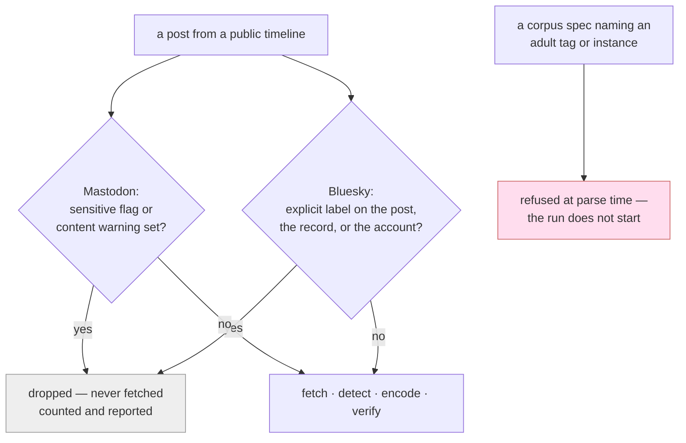

Four mechanisms, each reading the platforms' own metadata rather than
guessing:

| Layer | What it reads | Effect |
|---|---|---|
| Mastodon post | `status.sensitive`, `status.spoiler_text` | the poster's own content warning drops the post |
| Bluesky post | AT Protocol `labels[].val` on the post, the record's self-labels, and the **author's account** | `porn`, `sexual`, `nudity`, `graphic-media`, `gore`, … drop the post |
| Corpus spec | `ADULT_TAGS`, `ADULT_INSTANCES` in `search/safety.py` | `--corpus mastodon:tag/nsfw` or any corpus on an adult instance is **refused before the first request** |
| Reverse-image results | host against `ADULT_INSTANCES` | the provider returns bare URLs with no post metadata, so host-blocking is the only filter available at that layer |

The account-level check matters more than it looks: adult accounts on Bluesky
are usually labelled once, on the account, rather than on each post — so the
avatar route honours it too.

**It is reported, never silent.** A filter that quietly removes candidates is
indistinguishable from a search that found nothing, which is the same reason
`SourceReport` exists:

```
Stage 2: face-embedding search over a named corpus — 386 images ingested from 3 corpora
Stage 2: explicit-content filter removed 8 — 8 flagged sensitive (mastodon)
```

The count also lands in the evidence bundle as
`run.discovery.filtered_sensitive`, so a verifier can see that recall was
bounded by the filter and not only by the corpus.

Measured on the live timelines the demo uses, one page each:

```
#selfie   40 statuses | 7 sensitive-flagged | 36 images -> 30 kept  (6 removed)
#portrait 40 statuses | 3 sensitive-flagged | 58 images -> 56 kept  (2 removed)
```

The `#portrait` removals were posts with `Female Nudity` and `nudity body`
content warnings — exactly the material this exists to keep out of a
contact sheet.

#### What it does not do

- **It is not a classifier.** It trusts the poster and their instance's
  moderation. An explicit post that nobody flagged is not caught, and there is
  no local NSFW model in this repo. If that residual risk is unacceptable for
  your use, run against corpora you control (`mastodon:account/…`,
  `bsky:author/…`) rather than open hashtag timelines.
- **It over-filters, deliberately.** Mastodon's CW culture flags things like
  "eye contact" as sensitive, and those posts are dropped too. Losing some
  benign recall is the right trade against inlining a stranger's explicit
  photo into an HTML file — but it *is* a recall cost, and it is why the count
  is printed.
- **The denylists are a floor, not a wall.** `ADULT_INSTANCES` names the
  obvious ones; the fediverse is larger than any list.

`--allow-sensitive` turns the post-level filters off. It exists because this
is a research tool and the corpus you own is yours to search, but it is off by
default, it prints a warning when set, and it is recorded in the bundle as
`run.discovery.allow_sensitive`. The corpus-spec refusals are **not**
overridable by it.

### Genuine reverse-image search (`--discovery web-reverse`)

The arm that submits the image itself. The probe goes to a provider that
indexes the open web by image content, the URLs it returns are filtered down
to social-media posts, and every surviving candidate is then verified by face
before anything is anchored.

```bash
export GOOGLE_VISION_API_KEY=...        # see "Provider setup" below

faceanchor run --probe photo.jpg --subject-consent consent/self.example.json \
  --discovery web-reverse --provider google \
  --accept-external-upload \
  --chain anvil --contract-address $CONTRACT
```
```
Stage 1: face detected (score=0.899), quality gate passed
NOTICE: reverse-image search uploads the PROBE IMAGE ITSELF to an external provider (google_web_detection).
        This is a trust boundary no other discovery mode crosses: the photograph leaves this
        machine, and the provider's retention, logging and further use are outside this repo's
        control. The consent artifact covers the subject; it does not cover this transfer.
Stage 2: reverse-image search — submitting the probe image to google_web_detection
Stage 2: reverse-image results — 34 web images/pages in 812ms
Stage 2: social candidates — 6 (bsky 4, mastodon 2); skipped duplicate 3, no_image_url 1, not_social 24
Stage 2: 6 images fetched, verifying by face (SFace)
Stage 2: face verification — 1 candidate(s) above threshold
Stage 2: best match cosine=0.4812 platform=bsky uri=https://bsky.app/profile/...
Stage 3: tx submitted 0x...
Stage 3: included on-chain
Evidence bundle written: evidence/01M1GZ....json
```

#### Provider setup

`--provider google` is Google Cloud Vision **Web Detection**, called through
the official `images:annotate` REST API. Not browser automation, not scraping
the Images results page, not a text query built from the image's metadata —
the image bytes go up, base64 inline, and Google's index answers.

Enable the Cloud Vision API on a GCP project, then pick one credential route:

| Env var | What it is | Extra install |
|---|---|---|
| `GOOGLE_VISION_API_KEY` | a Cloud Vision API key, sent as the `key` query param | none |
| `GOOGLE_CLOUD_VISION_API_KEY` | the same, alternate name | none |
| `GOOGLE_APPLICATION_CREDENTIALS` | path to a service-account JSON, exchanged for an OAuth2 token | `pip install -e ".[vision]"` (pulls `google-auth`; minting the token means signing a JWT) |

Nothing is ever read from a config file in the repo, and no key appears in
any source file. **With neither variable set the run fails before the probe
is read.** There is no offline fallback, deliberately: a tool that quietly
degraded to a different kind of search and still called the result
reverse-image discovery would be lying in a way that is very hard to notice.

Two more optional knobs:

| Env var / flag | Effect |
|---|---|
| `--social-domain platform:domain` (repeatable) | Add a domain to the platform map, e.g. `--social-domain mastodon:example.social` |
| `FACEANCHOR_SOCIAL_DOMAINS` | Same, comma-separated: `mastodon:a.example,bsky:b.example` |
| `--accept-external-upload` | Acknowledge the transfer non-interactively. Required whenever stdin is not a TTY |
| `FACEANCHOR_MOCK_REVERSE_RESPONSE` | Only for `--provider mock` — see "Offline replay" below |

#### How a social-media candidate is identified

A reverse-image provider answers with the whole web: news sites, stock photo
pages, scrapers, someone's blog. Only results on platforms this pipeline can
actually handle end-to-end are kept — today Bluesky and Mastodon, the same
two the rest of the repo already parses, fetches and (for Bluesky) checks for
platform-side mutation at verify time.

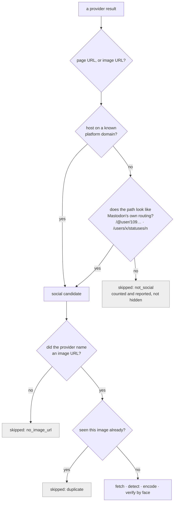

Mastodon is the awkward case — it is thousands of independent domains, so no
list can be complete. Hence both mechanisms: a seed list of well-known
instances that you extend with `--social-domain`, and a heuristic on
Mastodon's own URL layout, which is identical on every instance because it
comes from Mastodon rather than from any one operator.

Skips are counted and printed, never swallowed. "34 results, 0 social" and
"0 results" are different facts.

#### How face verification works

Unchanged, and deliberately so. The reverse-image provider and the face
encoder answer different questions and their scores are never combined:

- **the provider** says *this image appears on that page* — a claim about
  images, made by an index this repo does not control;
- **SFace** says *a face in this candidate is or is not the probe's face* — a
  cosine similarity against the same `0.363` accept threshold every other arm
  uses, computed locally, on the bytes actually downloaded.

A candidate becomes a match only if it clears the SFace threshold. A "full
match" from Google with no verifying face is discarded like any other
candidate, and if nothing verifies, the run exits without anchoring.

The threshold is a **policy choice**, not a probability. `score.value` is a
face similarity, not an identity probability, and nothing in this repo has
been statistically calibrated to claim otherwise. `--contact-sheet` exists
because a score above a threshold is not a verified match until a human has
looked at it.

#### What the evidence bundle records

The same schema, with one additive block. A bundle built the old way is
byte-identical to before, so existing digests still verify.

```json
{
  "run": {
    "observed_at": "2026-09-02T11:50:56Z",
    "discovery": {
      "mode": "web_reverse",
      "provider": "google_web_detection",
      "provider_results": 34,
      "social_candidates": 6,
      "platforms": ["bsky", "mastodon"]
    }
  },
  "probe": {
    "image_sha256": "…", "image_phash": "…",
    "embed_model": "sface_2021dec", "embed_sha256": "…",
    "consent_digest": "…"
  },
  "match": {
    "platform": "bsky",
    "uri": "https://bsky.app/profile/…/post/…",
    "image_url_sha256": "…", "image_sha256": "…",
    "reverse_image": {
      "provider": "google_web_detection",
      "match_type": "full",
      "page_url": "https://bsky.app/profile/…/post/…",
      "image_url": "https://cdn.bsky.app/img/…"
    }
  },
  "score": { "metric": "cosine", "value": 0.4812, "threshold": 0.363, "path": "embed" }
}
```

`match.reverse_image.image_url` is one of the few URLs kept in the clear
rather than hashed, because a reverse-image finding is only independently
checkable if a later reader can open the same image the provider pointed at —
a sha256 proves integrity but names nothing. It is passed through the same
signature redaction the candidate log uses, so a signed CDN URL loses its
bearer token before it is written.

Still absent, as everywhere else: raw embeddings, image bytes, the probe
photograph, display names.

#### What the blockchain proves — and what it does not

Unchanged by this arm, and worth restating because a reverse-image result is
exactly the kind of finding people over-read. The chain stores **one 32-byte
keccak256 of the JCS-canonicalised evidence record**, plus a CID. Nothing
else — no image, no embedding, no URL, no biometric data.

It proves the record has not been edited since it was anchored, and that it
existed by the anchoring block's timestamp. Change the page URL, the image
hash, the similarity, the provider, the platform or the match type by one
character and `verify` fails:

```bash
faceanchor verify --bundle evidence/latest.json --chain anvil --contract-address $CONTRACT
# OK — anchored at timestamp 1788349856

python3 -c "import json; d=json.load(open('evidence/latest.json')); \
  d['match']['reverse_image']['image_url']='https://cdn.bsky.app/img/other.jpg'; \
  json.dump(d, open('evidence/tampered.json','w'))"
faceanchor verify --bundle evidence/tampered.json --chain anvil --contract-address $CONTRACT
# FAIL — digest not found on-chain
```

It does **not** prove that the person is who anyone claims, that SFace is
correct, that Google's index is truthful, that the social post is authentic,
or that the subject consented — a consent digest in a record is a record of
an artifact, not of a person's agreement.

#### When the provider fails

`NO_RESULTS` and `PROVIDER_ERROR` are separate outcomes with separate exit
codes, because they are opposite facts and a caller must not have to parse
prose to tell them apart. A broken API key reading as "this face is nowhere
on the web" would be the worst thing this tool could get wrong.

| Situation | Reported as | Exit |
|---|---|---|
| Provider answered, found nothing | `NO_RESULTS` | 1 |
| Results found, none on a known social platform | `NO_RESULTS` (with the count and the skip breakdown) | 1 |
| Social candidates found, none passed face verification | `No match found above threshold` | 1 |
| Missing or rejected credentials | `PROVIDER_ERROR — ProviderAuthError` | 2 |
| Timeout, 5xx, transport failure | `PROVIDER_ERROR — ProviderTimeoutError` / `ProviderHTTPError` | 2 |
| Rate limited (429, or `RESOURCE_EXHAUSTED` inside a 200 body) | `PROVIDER_ERROR — ProviderRateLimitError` | 2 |
| Unreadable or non-JSON response body | `PROVIDER_ERROR — MalformedResponseError` | 2 |
| Unknown `--provider` name | config error, before anything is uploaded | 1 |

Per-candidate failures — a download that 404s, an oversized image the 512 KB
cap truncates, a corrupt file, a candidate with no detectable face — are
handled by the same cascade as every other arm and appear in
`--log-candidates` with verdicts `http_error`, `truncated`, `undecodable`,
`no_face`. A candidate with several faces uses the highest-confidence one,
also unchanged.

#### Privacy: a new trust boundary

Every other part of this pipeline sends hashes and words outward. This one
sends a photograph of a person's face to a third party whose retention,
logging and onward use nobody here controls.

So the transfer is its own gate, upstream of the network call and downstream
of the quality check — a photo that fails Stage 1 is rejected without ever
being uploaded. The CLI prints the notice and then either honours
`--accept-external-upload` or asks; with no TTY and no flag it refuses:

```
ERROR: refusing to upload the probe without an explicit acknowledgement.
       Re-run with --accept-external-upload.
```

The consent artifact covers using the subject's face in this pipeline. It
does not cover handing that face to Google, which is why the two gates are
separate and both are enforced. Nothing else changes: the probe and its
embedding still live in process memory for one run, no image is written
on-chain, and the candidate log still redacts signed CDN URLs.

#### Offline replay (`--provider mock`)

Development and CI need a deterministic path that costs nothing and calls
nobody. `--provider mock` replays a saved `images:annotate` response — through
the *same* `normalize_web_detection` the live provider uses, so the fixture
exercises the production parser rather than a parallel one written to agree
with it.

It is built to be impossible to mistake for the real thing: it is reachable
only by asking for it by name, nothing ever falls back to it, it refuses to
run without `FACEANCHOR_MOCK_REVERSE_RESPONSE`, the CLI prints a warning, and
its `provider_id` is `mock_replay` — so a replayed run leaves a permanent
record saying so, with a different digest from a real one's.

```bash
export FACEANCHOR_MOCK_REVERSE_RESPONSE=tests/fixtures/google_web_detection.json
faceanchor run --probe photo.jpg --subject-consent consent/self.example.json \
  --discovery web-reverse --provider mock --accept-external-upload \
  --chain anvil --contract-address $CONTRACT
```

#### Limitations of this arm

- **Recall is the provider's, not ours.** Google's index decides what is
  findable. A post it has not crawled does not exist to this pipeline, and no
  count here is a statement about the web.
- **Social filtering is a domain list plus one heuristic.** A Mastodon
  instance that is neither in the seed list nor URL-shaped like Mastodon is
  missed until you add it with `--social-domain`.
- **Only Bluesky and Mastodon are supported**, because those are the two the
  rest of the pipeline handles end-to-end. Widening the domain map to a
  platform whose posts cannot be fetched and described would produce evidence
  the bundle cannot state honestly.
- **The §7.2 platform-mutation check does not apply to these matches.** A
  reverse-image hit is located by its web permalink, not the `at://` record
  URI the AT Protocol APIs address, so there is nothing content-addressed to
  re-fetch and `verify --check-platform` reports `not_applicable` rather than
  inventing a verdict.
- **`match_type` is the provider's claim, not a verified property.** "Full
  match" means Google thinks it is the same image; it is recorded as
  provenance and it is not what decides the match.

### Seeing what the search actually did (`--log-candidates`)

Development aid: writes every URL the run looked at, and what became of it, as
JSONL keyed to the probe's own sha256/phash so a log can never be read against
the wrong image.

```bash
faceanchor run ... --log-candidates evidence/candidates.jsonl
# Stage 2: candidate log written: evidence/candidates.jsonl (243 URLs)
```

Line 1 is the header (probe hashes, corpora, per-source counts and failures);
every line after is one candidate URL with its fetch outcome and cascade
verdict merged:

```json
{"platform":"mastodon","image_url":"https://files.mastodon.social/.../small/48c6ba49.jpg",
 "post_uri":"https://c.im/@fonecokid/117195145208255942","author":"fonecokid@c.im",
 "variant":"preview","fetch":"ok","status":206,"bytes":44974,
 "verdict":"below_threshold","cosine":0.0465}
```

A real run reads like this — which is how you tell "the search is broken" from
"the search worked and the answer is no":

```
  131  below_threshold      cosine computed, max 0.2484 (threshold 0.363)
  109  no_face              fetched and decoded, YuNet found nobody
    3  not_scored           truncated at the 512KB cap, never reached the cascade
```

Verdicts: `match_phash`, `match_cosine`, `below_threshold`, `no_face`,
`undecodable`, `not_scored`.

`--contact-sheet evidence/review.html` goes further and embeds the **images**,
not just the links: probe first, then every fetched candidate as an inlined
thumbnail ordered by cosine, with anything above the accept threshold outlined.
Bytes are inlined rather than linked because social CDN URLs expire (and
Meta's are signed), so a sheet of links rots into broken images exactly when
you go back to review a disputed match.

It earns its keep immediately. A live by-face run over 404 corpus images
produced a top match at **cosine 0.4636** — comfortably over the 0.363
threshold, with the next candidate at 0.3067 — and the sheet shows at a glance
that it is a **cartoon drawing of Albert Einstein** on a quote graphic. A
score is not a verified match until a human has looked at it, and this is the
cheapest way to look. The log is **not** part of the evidence bundle
and is never anchored — it names third-party image URLs the pipeline merely
looked at and did not match, which is exactly the collateral that should not
go on an immutable ledger (PRD §6.3). It lives under `evidence/`, gitignored.

**The probe comes from your webcam.** Act 2 opens a live preview with
Stage 1's *own* quality gate running on every frame — the same
`detect_faces` → `check_single_face` → `check_quality` path the pipeline
uses (`scripts/capture_probe.py`):

```
  ┌───────────────────────────────┐
  │      [ live camera feed ]     │
  │        ┌───────────┐          │   green box = gate passing
  │        │   face    │          │   amber box = gate failing
  │        └───────────┘          │
  ├───────────────────────────────┤
  │ READY — SPACE to capture      │
  │ face 344px (>=80)  sharpness 67 (>=60)  pose 0.17 (<=0.35) │
  └───────────────────────────────┘
```

SPACE only fires once the gate is green, ESC aborts before anything is
written, and `F` force-keeps a failing frame if you want to watch the
pipeline reject it. The saved JPEG is re-gated after encoding, because the
pipeline reads the file, not the frame buffer. It lands at
`evidence/probe.jpg` — gitignored, never anchored, and yours to delete.

Pressing the shutter is the consent moment: `--subject-consent` defaults to
`consent/self.example.json` (Lane A, your own face). Point it at someone
else and you need their signed artifact — see [`docs/CONSENT.md`](docs/CONSENT.md).

The same thing by hand, act by act:

```bash
# deploy (prints two addresses: Groth16Verifier, EvidenceAnchor)
cd contracts && forge script script/Deploy.s.sol --rpc-url http://127.0.0.1:8545 \
  --private-key 0xac0974bec39a17e36ba4a6b4d238ff944bacb478cbed5efcae784d7bf4f2ff80 --broadcast
cd ..

export CONTRACT=<EvidenceAnchor address from above>

# Stage 1 -> 2 -> 3: probe a face, find a real match, anchor it
faceanchor run --probe photo.jpg --subject-consent consent/self.example.json \
  --query "some search terms" --chain anvil --contract-address $CONTRACT

# ...or the same three stages driven by genuine reverse-image search
faceanchor run --probe photo.jpg --subject-consent consent/self.example.json \
  --discovery web-reverse --provider google --accept-external-upload \
  --chain anvil --contract-address $CONTRACT

# independent re-verification
faceanchor verify --bundle evidence/latest.json --chain anvil --contract-address $CONTRACT
# OK — anchored at timestamp ...

# tamper demo
python3 -c "import json; d=json.load(open('evidence/latest.json')); d['score']['value']=0.9999; json.dump(d, open('evidence/latest.json','w'))"
faceanchor verify --bundle evidence/latest.json --chain anvil --contract-address $CONTRACT
# FAIL — digest not found on-chain

# innovation beats (§7)
faceanchor run --probe photo.jpg --subject-consent consent/self.example.json \
  --query "..." --chain anvil --contract-address $CONTRACT --zk
# -> bundle has a 192-byte proof, zero occurrences of "embedding"

faceanchor forge-score --bundle evidence/latest.json --score 0.99 --chain anvil --contract-address $CONTRACT
# chain REJECTS: BadProof

faceanchor verify --bundle evidence/latest.json --chain anvil --contract-address $CONTRACT --check-platform
# platform check: not_applicable (or a real bsky mutation-detection verdict)

faceanchor revoke --consent consent/self.example.json --chain anvil --contract-address $CONTRACT
faceanchor verify --bundle evidence/latest.json --chain anvil --contract-address $CONTRACT
# OK — anchored ..., plus: ⚠ CONSENT REVOKED @ timestamp ...
```

Every command above was run live against a local Anvil node while building
this repo — the `run --query "official portrait headshot high resolution"`
example genuinely finds and anchors a real Wikimedia Commons portrait, no
hardcoded matching.

Public-testnet (`--chain amoy`) needs `AMOY_RPC_URL` + `AMOY_PRIVATE_KEY`
env vars pointing at a funded wallet — not something this repo can
provision for you. `--chain solana` (`src/faceanchor/chain/solana.py`, SPL
Memo, no custom program needed) takes `SOLANA_KEYPAIR` and optional
`SOLANA_RPC_URL`, and needs no `--contract-address`; it wasn't exercised
against a live devnet transaction — the public devnet faucet rate-limited
every airdrop attempt from the sandbox this was built in.

## Checking the on-chain footprint

`faceanchor footprint` reports what the *contract* has recorded, reading none
of the evidence files — the chain's own account, which is the only part a
stranger has to believe:

```bash
faceanchor footprint --chain anvil --contract-address $CONTRACT --bundle evidence/latest.json
```
```
contract 0xe7f1725E…F0512 on anvil — 3 record(s) from block 0
  [        2] Anchored 43d52a51…ea7f ts=1788262102
              cid=bafkreiaqfu2gcovgghpcynqbemacs3tb55swv6ub22pk57ibbdofbu4xqa
  [        3] Anchored 95706295…7bea ts=1788262102 <- this bundle
              cid=bafkreicl4p7v7eaegsdc3glzlwuye4z7cq6gyfp5weo2yvjmucmedrybka
  [        4] Revoked  1488aa60…9505 ts=1788262102

Public footprint: none — anvil is a local devnet. It exists on this machine
only and dies with the node; nobody can check it on the web.
```

**In development everything is local, and the tooling says so rather than
implying otherwise.** Anvil has no block explorer entry on purpose (there is
no `Explorer` registered for it), so the CLI reports "none" instead of
fabricating a link. A digest anchored on Anvil is checkable by you, on this
machine, until the node exits — and by nobody else, ever.

When you *do* want a public record, `--chain amoy` needs `AMOY_RPC_URL` +
`AMOY_PRIVATE_KEY` for a funded wallet, and prints a warning first, because an
anchor cannot be un-anchored — only flagged revoked (§7.3). Then the same
command emits PolygonScan links, and the useful property arrives: a third
party opens `…/address/<contract>#readContract`, calls `verify(bytes32)` with
the digest from the bundle, and gets the timestamp back **without running any
of this code**. That is what makes the anchor worth anything — verification by
a route we do not control.

## Tests

```bash
make test   # forge test (contracts) + pytest (Python)
```

198 tests, all green as of the last commit: 18 Solidity (EvidenceAnchor +
Groth16 verifier, including a real hardcoded Groth16 proof exercised against
the actual deployed verifier), 180 Python. ZK tests (`tests/test_zk.py`) skip
cleanly if `zk/setup.sh` hasn't been run.

One further Python test is **skipped by default** and not counted above:
`test_live_google_web_detection` calls the real Cloud Vision API, and needs
both `FACEANCHOR_LIVE_VISION=1` and a real credential before it will run. A
unit suite that spends money on a third party is a unit suite that stops
being run, so every other reverse-image test uses a mocked transport
(`httpx.MockTransport`) or the saved response fixture.

```bash
make bench  # p50/p95/p99 per stage, taskset-pinned to P-cores
```

Report CPU-only numbers from a cool machine (PRD §5.4) — GPU only earns its
keep on the candidate batch-embed step, and both CPU/GPU numbers are noisy
under laptop thermal/frequency-scaling variance; don't over-trust a single run.

## What's real vs. what needed external resources I don't have

Everything below was built, and where "verified live" is stated, actually
run against a real network/chain during this build — not just written and
assumed correct:

| Piece | Status |
|---|---|
| Stage 1 (YuNet detect + align + SFace embed, CPU and CUDA-batch) | Verified live; p50 17ms P-core-pinned |
| Reverse-image search (`--discovery web-reverse`, Google Cloud Vision Web Detection) | The provider call is real and is the only code path — there is no offline fallback. Not exercised against live Google: this build has no Cloud Vision credential. Everything downstream of the provider (normalization, social filtering, dedup, bounded fetch, face verification, evidence, anchor, tamper detection) **was** run end-to-end, against a replayed provider response and a live Anvil chain |
| Stage 2 discovery (Bluesky, Mastodon, Commons, DuckDuckGo Arm B) | All four verified live, and every source reports its own count/failure per run (`Stage 2: per-source — …`). Bluesky's `searchPosts` is IP-blocked for anonymous callers after a burst (403), so the arm also resolves a handle via `getProfile`+`getAuthorFeed`, which is not blocked; Mastodon's anonymous status search is auth-gated (HTTP 200, empty), so that arm also uses account-lookup and hashtag-timeline routes. See "Known limitations". |
| Stage 3 anchor (EvidenceAnchor.sol, JCS/CID, Anvil) | Verified live, including the tamper demo |
| Amoy (public testnet) | Code path exists (`chain/evm.py` + `poa=True`), never deployed — needs a funded wallet key this environment doesn't have |
| Solana devnet (SPL Memo) | Reachable as `--chain solana` (`SOLANA_KEYPAIR`), unit-tested. Verified live as far as devnet allows: the memo transaction builds, signs, and passes `simulateTransaction` with `sigVerify` against devnet — it fails only on `AccountNotFound`, i.e. an unfunded fee payer. Never landed on-chain: `requestAirdrop` returns HTTP 429 (*"reached your airdrop limit today"*) from this sandbox's IP, and the web faucet's per-account limit was already spent. `revoke`/`--zk` refuse on this chain by design, per the adapter matrix |
| §7.2 platform-mutation detection | Logic verified against a mocked Bluesky transport (real network blocked, same as above) |
| §7.3 consent revocation | Verified live end-to-end (`revoke` -> `verify` shows the warning) |
| §7.1 ZK match proof (L1 off-chain, L2 on-chain) | Verified live end-to-end, including proof generation *failing* for a below-threshold pair and the chain rejecting a forged score with `BadProof()` |

## Known limitations

See PRD §11 for the full list (recall is corpus-bounded, SFace's accuracy
ceiling, threshold is a policy choice not a guarantee, on-chain proof is of
*observation* not *truth*, testnet impermanence). PRD §11's "no
liveness/anti-spoof detection" is now partly addressed: `scripts/capture_probe.py`
refuses a frame the MiniFASNet ensemble calls a print or replay attack. It is a
single-frame RGB classifier, so it does not stop a good mask, an unseen attack,
or a synthetic frame injected below the camera API — and it only runs where it
can mean something, on a live capture, never on a probe handed in as a file. PRD §11's "no reverse-image search anywhere" no longer holds:
`--discovery web-reverse` is genuine image-based reverse-image search through
Google Cloud Vision Web Detection, with its own limitations documented under
"Genuine reverse-image search" above. `--by-face` is a *face-embedding search
over a corpus you name* — an earlier revision of this README called it
reverse-image search, which overstated it; it never submits the image
anywhere. Additions found while building:

- **`search/commons.py` fetches a bounded-width thumbnail, not the
  original.** Commons originals commonly exceed the 512KB Range-cap fetch
  (PRD §5.2, sized for social-feed images); a raw capped fetch of a
  multi-MB original truncates mid-JPEG and produces decode artifacts that
  spuriously fail the blur quality gate. Fixed by requesting `iiurlwidth`.
- **Two of the three Arm A sources return nothing on the obvious route, and
  the fanout used to hide it.** A live audit (measured, not assumed):
  Bluesky's `app.bsky.feed.searchPosts` answers 200 for a handful of anonymous
  calls and then serves `403 Request forbidden by administrative rules` to
  that IP — on both `public.api.bsky.app` and `api.bsky.app`, identically
  across HTTP/1.1 and h2, with a browser UA, our UA, and no UA, while
  `getProfile`/`getAuthorFeed` on the same host in the same second keep
  answering 200. Mastodon's `/api/v2/search?type=statuses` is auth-gated and
  returns a well-formed **HTTP 200 with an empty list** to anonymous callers,
  which is indistinguishable from "no hits" unless you look. `arm_a_fanout`
  caught every exception and returned `[]`, so a half-dead fanout looked
  exactly like a working one — 22 candidates, no warning, no clue that two of
  three socials contributed zero. Fixed three ways: both arms grew
  credential-free handle routes (Bluesky `getProfile`+`getAuthorFeed`,
  Mastodon `accounts/lookup`+`accounts/:id/statuses` and hashtag timelines,
  each also yielding the account avatar); every source now returns a
  `SourceReport` with its count, latency and failure reason; and `run` prints
  the per-source breakdown plus a warning whenever any source failed.
  Measured after the fix, one query: `bsky 7, mastodon 0, commons 20, ddg 20`
  → 47 candidates, vs `commons 2, ddg 20` → 22 before.

- **The OpenCV Zoo SFace export lists every weight in `graph.input`.** A
  pre-IR-4 convention: ONNX Runtime therefore treats all ~300 initializers as
  overridable, declines to const-fold them, and prints one warning per weight —
  349 lines of stderr in front of anything the pipeline says. The batch-dynamic
  rewrite in `vision/models.py` now strips initializers out of `graph.input`
  (what ORT's own `remove_initializer_from_input.py` does), which silences the
  warnings and re-enables the folding. Verified bit-comparable to both the
  upstream graph and cv2's reference path (cosine 1.0, max abs diff 3e-07).

- **The ZK circuit's vector commitment is a 2-level Poseidon tree, not a
  literal single-call sponge over 128 elements.** circomlib only ships
  precomputed round constants up to 16 Poseidon inputs; there's no
  off-the-shelf single permutation over a 129-wide state. The tree (8 ×
  Poseidon(16) → Poseidon(8)) has the same binding-commitment security
  property, built from arities circomlib actually supports. Documented
  inline in `zk/circuits/match.circom`.
- **`contracts/src/Groth16Verifier.sol` is GPL-3.0**, generated verbatim by
  `snarkjs zkey export solidityverifier`. Everything else in the repo is
  MIT/Apache-2.0 (PRD §G5's "permissive licenses only" goal). Scoped to the
  opt-in `--zk`/`anchorWithProof` path only — the default `anchor`/`verify`
  path never touches it. Same pattern PRD §5.1 already uses for buffalo_l's
  non-commercial weights: flag it, keep it out of the default path.
- **Solana's `verify()` is wallet-scoped, not a global O(1) lookup.** SPL
  Memo has no on-chain state at all (that's the whole point of using it —
  no custom program), so there's no `eth_call`-equivalent. `chain/solana.py`
  scans the anchoring wallet's own recent signature history for a matching
  memo. A real limitation of the memo-only design, not a corner cut.

## Repo layout

See PRD §8. `contracts/lib/forge-std` is vendored (not a submodule) since
`contracts/` was scaffolded with `forge init --no-git` inside a repo that
already had its own git root.
